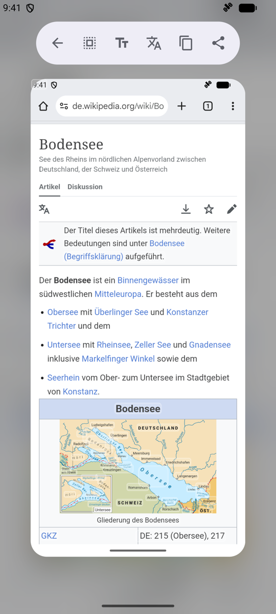
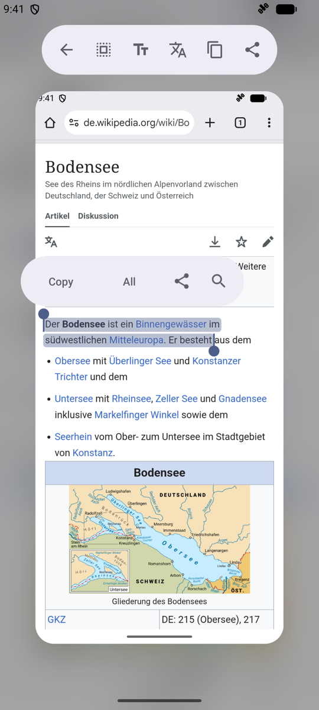
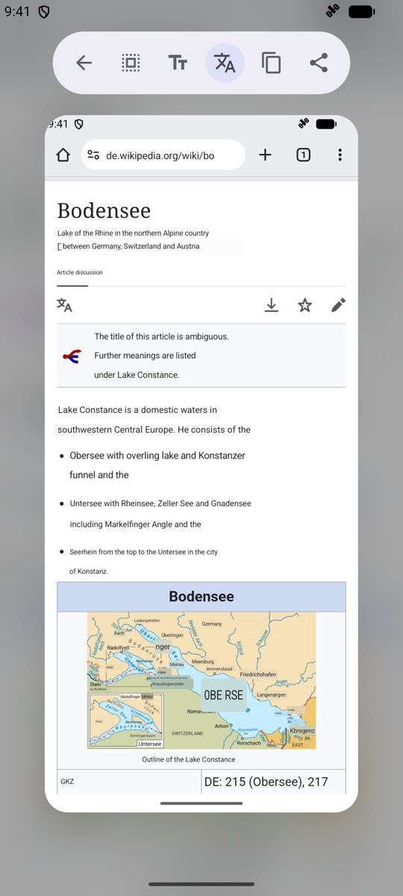

# TextGrab

Select, copy and translate the text of anything on your Android screen. One
gesture captures the screen, and a moment later every word on it is
selectable. Like iOS Live Text or Circle to Search, but the recognition runs
on your device and needs no Google Play services.

| Capture any screen | Select like native text | Translate in place |
|---|---|---|
|  |  |  |

## Install

Download the latest APK from
[Releases](https://github.com/AhmetCanArslan/TextGrab/releases) and open it on
your phone. Requires Android 8.0 or newer; screen capture needs Android 11 or
newer. The APK is about 110 MB because the recognition models are bundled.

## Setup

The home screen lists whatever is still missing and hides each row once it is
done.

1. **Turn on screen capture.** Tap **Turn on screen capture** and enable
   *TextGrab screen capture* under accessibility settings. The service only
   takes screenshots; it cannot read window content.
2. **Add the tile.** Open quick settings, tap the edit (pencil) button and
   drag the **OCR screenshot** tile into your tiles.
3. **Set as assistant app** (optional). Pick TextGrab under *Settings → Apps →
   Default apps → Digital assistant app* to capture with a long-press on home
   or the navigation handle. On devices with Circle to Search, turn that off
   first.

## How to use

**From the screen:** tap the **OCR screenshot** tile or long-press home. Then
tap a word, or long-press and drag across the text. The floating toolbar
copies, shares or searches the selection; the top bar acts on the whole
screen.

**From an image:** share an image to **TextGrab** from any app, or tap
**Choose image** on the home screen. This needs no setup and no permission.

**From the camera:** tap **Camera** on the home screen, or
long-press the app icon and pick **Camera**. Point the
viewfinder at the text (pinch to zoom, tap to focus), press the shutter, and
the photo opens like any other image: select, copy or translate. The camera
permission is requested the first time; photos are not kept.

**Translate:** tap the translate button in the top bar and every line is
replaced in place by its translation. Tap again to show the original;
long-press to pick the target language. The source language is detected
automatically.

## Translation engines

Choose one under **Translation engine** on the home screen.

| Engine | Runs | Notes |
|---|---|---|
| On-device (ML Kit) | On your device | The default. Free and private. Language packs are about 30 MB each and work offline once downloaded. |
| DeepL | DeepL's API | Natural wording, strong on European languages. |
| Google Cloud Translation | Google's API | The widest language coverage. |
| LLM (OpenAI-compatible) | Any `/chat/completions` endpoint | Presets for OpenAI, Gemini, DeepSeek, OpenRouter, Groq, Mistral, Together, Ollama and LM Studio. |
| Claude (Anthropic) | Anthropic's API | Good with interface wording and short labels. |

Cloud engines need your own API key; the **Test** button checks it before you
save.

## Privacy

- Text recognition always runs on the device.
- With the on-device translation engine, the internet is used only to
  download language packs. Recognized text never leaves the device.
- With a cloud engine, the text of the screen you translate is sent to the
  service you configured, and only when you tap translate.
- Captured screens are held in memory only and are never saved.
- The app requests no storage, photo or camera permission.

## Supported languages

**Recognition:** Latin-script languages (English, German, French, Spanish,
Turkish, Vietnamese and many more), plus Chinese, Japanese and Korean. Arabic,
Cyrillic and Devanagari are not recognized yet.

**Translation:** about 60 languages on device; cloud engines cover whatever
the service supports.

**Capture** can also be triggered from adb:

```sh
adb shell am broadcast --receiver-foreground -a com.arslan.textgrab.action.CAPTURE -p com.arslan.textgrab
```

## Credits and license

TextGrab is a fork of [notune/TextGrab](https://github.com/notune/TextGrab).
It adds instant screen capture, the assistant gesture, in-place translation,
Chinese, Japanese and Korean recognition, and a redesigned interface. It uses
its own package name, `com.arslan.textgrab`, so it installs next to the
original.

The app source code is licensed under the [MIT License](LICENSE). The bundled
ML Kit SDKs and their models are proprietary Google software, used under the
[ML Kit Terms of Service](https://developers.google.com/ml-kit/terms).
