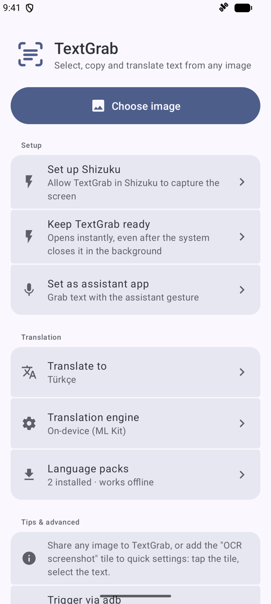
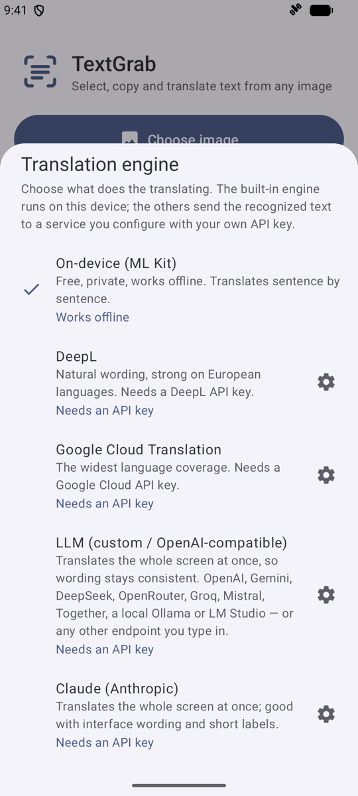
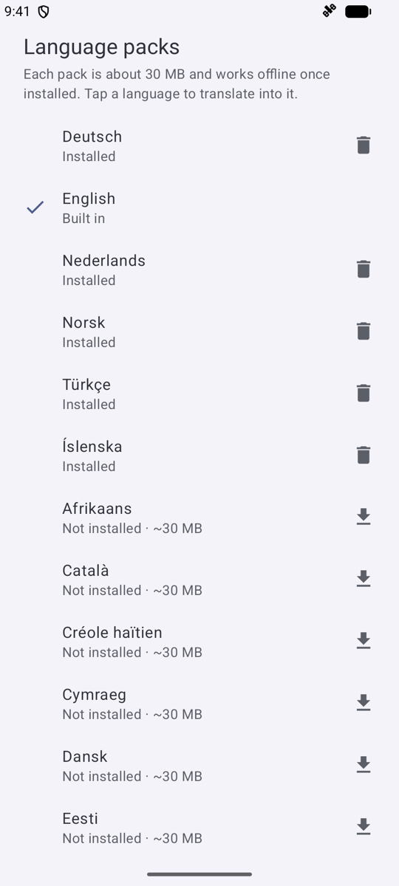
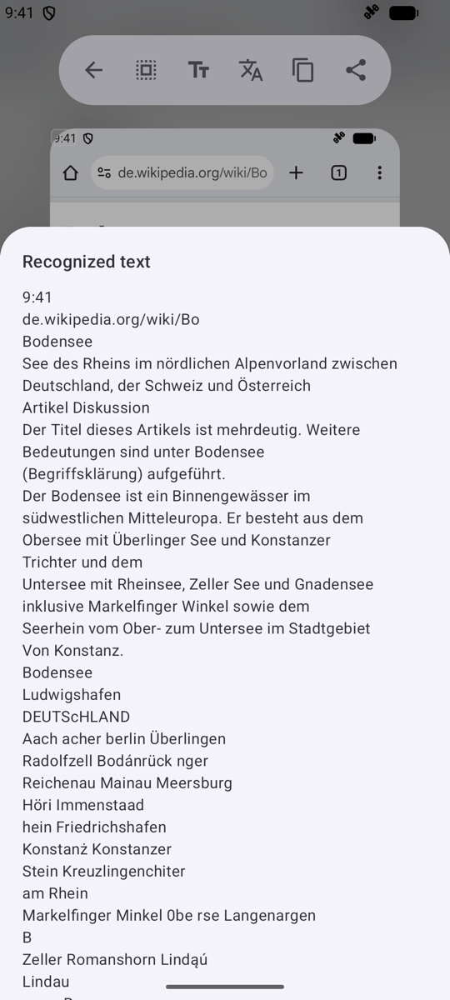

# TextGrab

**TextGrab on steroids.** Select, copy and translate the text of anything on
your Android screen: one gesture captures the screen, and a moment later every
word on it is selectable. Like iOS Live Text or Circle to Search, but the
recognition runs on your device and needs no Google Play services.

This is a fork of [notune/TextGrab](https://github.com/notune/TextGrab) that
has grown well past the original: instant screen capture through Shizuku, an
assistant gesture, in-place translation with a choice of engines, Chinese,
Japanese and Korean recognition, and a redesigned Material 3 interface. It
uses its own package name, `com.arslan.textgrab`, so it installs next to the
original instead of replacing it.

| Capture any screen | Select like native text | Translate in place |
|---|---|---|
|  |  |  |

## What it adds over the original

- **Instant capture.** The quick settings tile, the assistant gesture and an
  adb command all grab the current screen directly. No screenshot is saved to
  your gallery first.
- **Assistant gesture.** Long-press home or the navigation handle to grab
  text from whatever is on screen.
- **Capture preview.** A capture opens slightly shrunk with rounded corners
  over a blurred copy of the screen, so text at the very edges is easy to
  reach.
- **Native-feeling selection.** Dragging follows lines instead of jumping
  between words, handles keep their grab offset, and copied text has no stray
  empty lines.
- **Translation in place.** Every recognized line is replaced by its
  translation right on the image, and the translated text can be selected and
  copied too.
- **Five translation engines.** On-device ML Kit by default, or DeepL, Google
  Cloud Translation, any OpenAI-compatible LLM endpoint, or Claude, each with
  your own API key.
- **Better recognition.** Icons and stray symbols are filtered out, lines are
  ordered the way they appear on screen, and Chinese, Japanese and Korean
  models are bundled.
- **Always ready.** An optional keep-alive service stops Android from killing
  the app in the background, so captures open without a cold start.

## Setup

The home screen lists whatever is still missing and hides each row once it is
done.

| Home screen | Translation engines | Language packs |
|---|---|---|
|  |  |  |

1. **Set up Shizuku.** TextGrab captures the screen through
   [Shizuku](https://shizuku.rikka.app/). Install it, start it (wireless
   debugging, adb or root), then tap **Set up Shizuku** in TextGrab and allow
   access. Screen capture does not work without it; opening images does.
2. **Add the tile.** Open quick settings, tap the edit (pencil) button and
   drag the **OCR screenshot** tile into your tiles.
3. **Keep TextGrab ready** (optional). Enable *TextGrab keep ready* under
   accessibility settings. The service only keeps the process alive: it
   receives no accessibility events and cannot read window content.
4. **Set as assistant app** (optional). Pick TextGrab under *Settings → Apps →
   Default apps → Digital assistant app* to capture with a long-press on home
   or the navigation handle. On devices with Circle to Search, turn that off
   first.

## How to use

**Grab text from the screen**

1. Tap the **OCR screenshot** tile, or long-press home.
2. Tap a word, or long-press and drag across the text.
3. Use the floating toolbar to copy, select all, share or search the web.

The top bar acts on the whole screen: select all, view as plain text,
translate, copy all, share all.

**Grab text from an image**

Share an image from any app to **TextGrab**, open an image file with it from a
file manager, or tap **Choose image** on the home screen. This needs neither
Shizuku nor any permission.

| Full text view |
|---|
|  |

**Trigger from ADB**

```sh
adb shell am broadcast -a com.arslan.textgrab.action.CAPTURE -p com.arslan.textgrab
```

The home screen shows this command and copies it on tap. The receiver requires
the `DUMP` permission, so adb can send the broadcast but other apps cannot.

## Translation

Tap the translate button in the top bar and every recognized line is replaced
in place by its translation. Tap it again to show the original; long-press it
to pick the target language. The source language is detected automatically
with ML Kit's bundled language identification model, so a screen
that mixes languages still translates. The target language is remembered.

Choose the engine under **Translation engine** on the home screen:

| Engine | Runs | Notes |
|---|---|---|
| On-device (ML Kit) | On your device | The default. Free and private. Translates sentence by sentence. |
| DeepL | DeepL's API | Natural wording, strong on European languages. Free keys (ending in `:fx`) are detected automatically. |
| Google Cloud Translation | Google's API | The widest language coverage. |
| LLM (OpenAI-compatible) | Any `/chat/completions` endpoint | Translates the whole screen at once, so wording stays consistent. Presets for OpenAI, Gemini, DeepSeek, OpenRouter, Groq, Mistral, Together, Ollama and LM Studio, or type your own endpoint and model. |
| Claude (Anthropic) | Anthropic's API | Translates the whole screen at once; good with interface wording and short labels. |

Each cloud engine has a **Test** button that checks your key before you save
it. A server on the device itself (Ollama, LM Studio on `localhost`) needs no
key.

For the on-device engine, each language pack is about 30 MB. It is downloaded
from Google's servers the first time it is needed and works offline after
that. **Language packs** on the home screen lets you download packs ahead of
time and delete the ones you no longer want.

## Privacy

- Text recognition always runs on the device. The recognition models are
  packaged inside the APK and need no Google Play services, so the app works
  on GrapheneOS out of the box.
- With the on-device translation engine, the internet is used only to
  download language packs. Recognized text never leaves the device.
- With a cloud translation engine, the recognized text of the screen you
  translate is sent to the service you configured. Nothing is sent until you
  tap translate. API keys are stored in the app's private storage.
- Captured screens are held in memory only and are never written to storage.
- The app requests no storage, photo or camera permission.

## Supported languages

**Recognition:** all Latin-script languages, including English, German,
French, Spanish, Italian, Portuguese, Dutch, Polish, Czech, Danish, Swedish,
Norwegian, Finnish, Hungarian, Romanian, Turkish, Croatian, Slovak, Slovenian,
Estonian, Latvian, Lithuanian, Albanian, Catalan, Basque, Galician, Icelandic,
Irish, Maltese, Swahili, Tagalog, Vietnamese (partial, some diacritics may be
missed) and more, plus digits and common punctuation.

Chinese, Japanese and Korean are bundled as well, and each of them also reads
Latin text. They only run when the Latin recognizer's result looks
unreliable, so Latin text stays fast. Arabic, Cyrillic and Devanagari are not
recognized yet.

**Translation:** the on-device engine covers the roughly 60 languages ML Kit
offers. Cloud engines cover whatever the service supports.

## Building

```sh
./gradlew assembleRelease
```

Output: `app/build/outputs/apk/release/app-release.apk`.

To build a signed release, create a keystore and put its credentials in
`keystore/keystore.properties` (this directory is gitignored):

```properties
storeFile=keystore/your-release.jks
storePassword=...
keyAlias=...
keyPassword=...
```

Without that file the release build is unsigned
(`app-release-unsigned.apk`). Keep your keystore safe: updates must be signed
with the same key.

## Notes

- `minSdk 26` (Android 8.0), `targetSdk 36`.
- The APK is about 110 MB. Most of that is the four bundled recognition
  models (Latin, Chinese, Japanese, Korean).
- Models are loaded on demand and released when the app leaves the screen, so
  it holds little memory while idle.

## License

The app source code is licensed under the [MIT License](LICENSE).

The bundled ML Kit SDKs and their models are proprietary Google software,
used and redistributed under the
[ML Kit Terms of Service](https://developers.google.com/ml-kit/terms). They
are pulled from Google's Maven repository at build time and are not part of
this repository.
